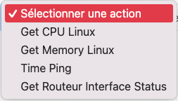
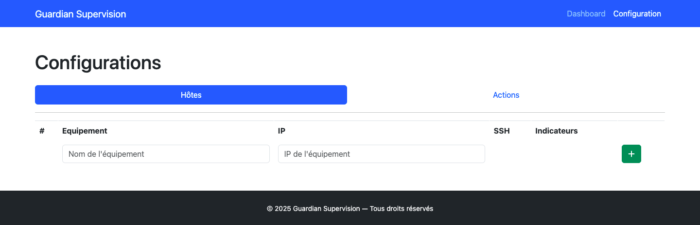
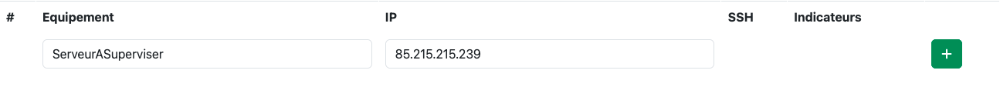
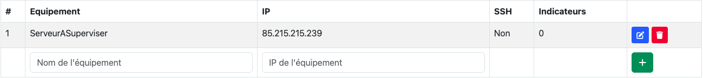
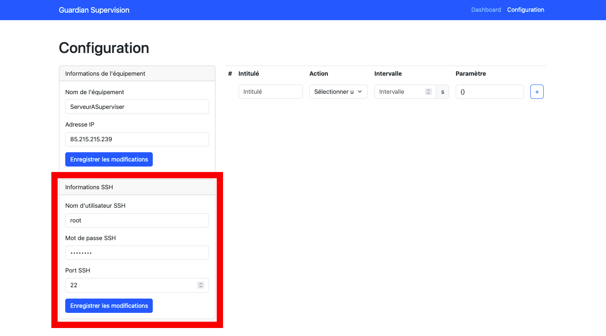
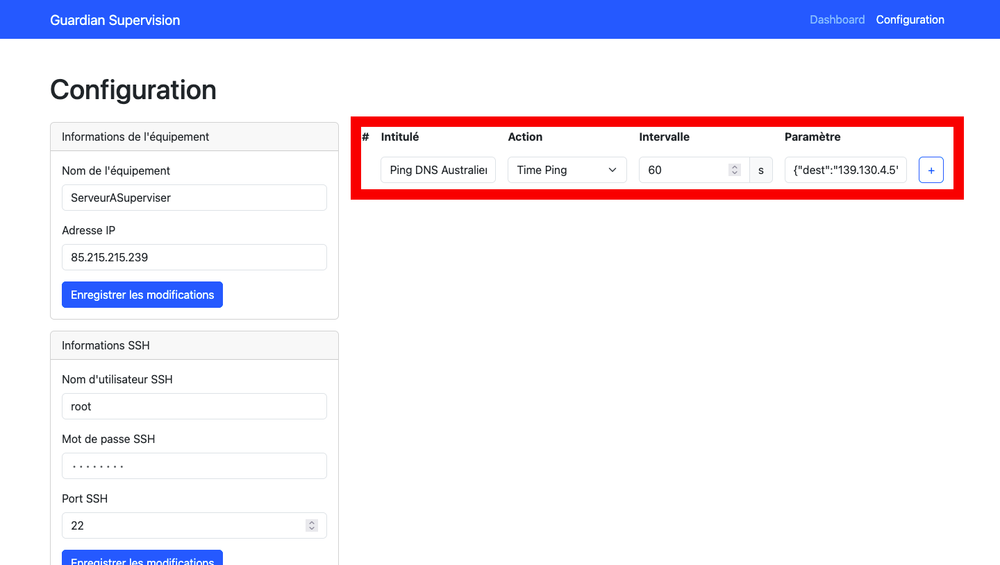
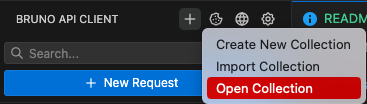
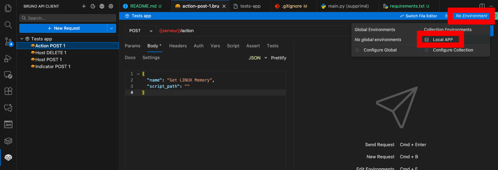
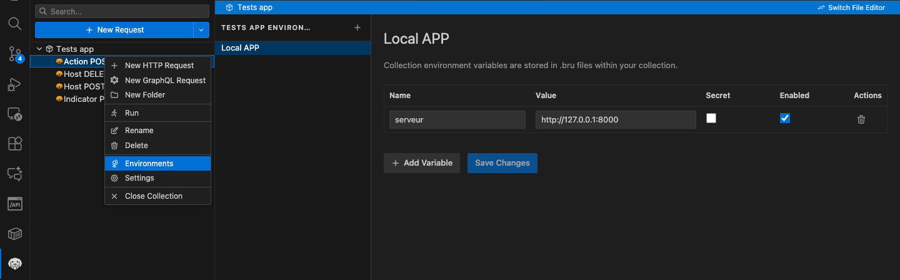

# R507 - Guardian Supervision
## 📋 Réalisation par Téo HUBERT - BUT R&T Saint Malo 3ème Année DEV CLOUD

> **Lien GitHub :** https://github.com/TeoHubert/r507

## 📖 Table des matières
- [Contexte du projet](#contexte-du-projet)
- [Architecture](#architecture)
- [Fonctionnalités](#fonctionnalités)
- [Installation et déploiement](#installation-et-déploiement)
- [Configuration](#configuration)
- [API Documentation](#api-documentation)
- [Sécurité](#sécurité)
- [Tests](#tests)
- [Développement](#développement)
- [Troubleshooting](#troubleshooting)

---

## 🎯 Contexte du projet

Guardian Supervision est un outil de supervision d'infrastructures permettant de monitorer des indicateurs système (Mémoire, CPU, connectivité réseau) sur différentes cibles distantes via SSH.

**Stack technique :**
- **Backend :** Python, FastAPI, SQLModel, Alembic, Pydantic
- **Frontend :** HTML5, Bootstrap 5.3, JavaScript vanilla, Chart.js
- **Base de données :** SQLite
- **Conteneurisation :** Docker & Docker Compose
- **Sécurité :** Chiffrement AES des mots de passe SSH

---

## 🏗️ Architecture

```
r507/
├── 📁 server/                     # API Backend
│   ├── 🐳 Dockerfile
│   └── 📁 app/
│   └── 📁 app/
│       ├── 📋 main.py            # Point d'entrée FastAPI
│       ├── 🗄️ database.py       # Configuration SQLite
│       ├── ⚙️ scheduler.py       # Planificateur automatique
│       ├── 📁 models/            # Modèles de données
│       │   ├── 🖥️ host.py        # Gestion des hôtes
│       │   ├── ⚡ action.py      # Scripts d'actions
│       │   ├── 📊 indicator.py   # Indicateurs
│       │   └── 📁 actions/       # Scripts de supervision (customisation et ajout ici)
│       ├── 📁 tools/             # Utilitaires
│       │   └── 🔒 password_security.py
│       └── 📁 alembic/           # Migrations BDD
├── 📁 frontend/                   # Interface Web
│   ├── 🐳 Dockerfile
│   └── 📁 html/
│       ├── 🏠 index.html         # Dashboard principal
│       ├── ⚙️ configuration.html # Gestion config
│       ├── ⚙️ configuration_edithost.html # Editeur de hôte
│       ├── ⚙️ configuration_actions.html # Editeur d'action
│       └── 📈 graph.js           # Graphiques temps réel
│       └── 📈 toaster.js         # Système de notification utilisateur
├── 📁 tests/                     # Tests API
│   └── 📁 server/bruno/          # Collection Bruno
└── 🐳 docker-compose.yml         # Orchestration
```

---

## 🚀 Fonctionnalités

### 🖥️ Supervision d'hôtes
- **Ajout/suppression d'hôtes** avec connexion SSH sécurisée
- **Surveillance automatique** avec intervalles configurables
- **Actions système prédéfinées :**
  - 🧠 Utilisation mémoire Linux (`memory_linux.py`)
  - 🔥 Utilisation CPU Linux (`cpu_linux.py`)
  - 🗄️ État de l'interface d'un routeur (`get_interface_status.py`)
  - 🌐 Test de connectivité et latence (`ping_time_linux.py`)



### 📊 Monitoring en temps réel
- **Dashboard interactif** avec accordéon par hôte
- **Graphiques temporels** avec Chart.js
- **Exécution manuelle** d'indicateurs
- **Historique** des valeurs collectées

### 🔐 Sécurité
- **Chiffrement AES-256** des mots de passe SSH
- **Clé de chiffrement** automatiquement générée (`secret.key`)
- **Connexions SSH sécurisées** avec Paramiko

### 🗄️ Gestion des données
- **Base SQLite** avec migrations Alembic
- **API REST** complète avec FastAPI
- **Planificateur automatique** de collecte

---

## 📦 Installation et déploiement

### 🐳 Déploiement avec Docker (Recommandé)

1. **Cloner le repository :**
```bash
git clone https://github.com/TeoHubert/r507.git
cd r507
```

2. **Lancer l'application :**
```bash
docker compose up --build
```

3. **Accéder aux services :**
- **Interface web :** http://localhost:80
- **API Backend :** http://localhost:8000
- **Documentation API :** http://localhost:8000/docs

### 🛠️ Déploiement en environnement local (Non recommandé sauf pour DEV)

#### Prérequis
- Python 3.9+
- Poetry

#### Installation Backend
```bash
# Créer un environnement virtuel
python -m venv venv
source venv/bin/activate  # Linux/macOS
# venv\Scripts\activate   # Windows

# Installer Poetry
pip install poetry

# Installer les dépendances
cd server/app
poetry install

# Configurer la base de données
poetry run alembic upgrade head

# Lancer le serveur
poetry run uvicorn main:app --reload --port 8000
```

#### Partie Frontend
Ouvrir le fichier HTML `index.html` présent dans `./frontend/html/` puis naviguer.

---

## ⚙️ Configuration de l'utilisation

> Conseillé d'utilisé l'interface graphique web

### 🖥️ Ajout d'un hôte

1. **Via l'interface web :**
   - Aller dans l'onglet `Configuration`
     
   - Remplir les informations de l'hôte et faire "+"
     
   - Entrer dans le menu de configuration de l'hôte avec le bouton bleu éditer à droite de la ligne correspondante venant d'être ajouté au tableau
     
   - Compléter les paramtères SSH puis sauvegarder
     

2. **Via API REST :**
```bash
curl -X POST "http://localhost:8000/host" \
  -H "Content-Type: application/json" \
  -d '{
    "name": "Mon Serveur",
    "ip": "192.168.1.100",
    "ssh_port": 22,
    "username": "admin",
    "password": "motdepasse"
  }'
```

### 📊 Configuration des indicateurs sur un hôte

1. **Via l'interface web :**
   
   - Maintenant l'Hôte configuré, sur la page de configuration l'hôte concerné ajouter un indicateur
     
   - Faire "+" pour valider l'ajout


2. **Via API REST :**

```bash
# Ajouter un indicateur mémoire
curl -X POST "http://localhost:8000/host/1/indicator" \
  -H "Content-Type: application/json" \
  -d '{
    "name": "Utilisation RAM",
    "action_id": 1,
    "interval": 300
  }'

# Ajouter un indicateur ping avec destination personnalisée
curl -X POST "http://localhost:8000/host/1/indicator" \
  -H "Content-Type: application/json" \
  -d '{
    "name": "Ping Google",
    "action_id": 3,
    "interval": 60,
    "parametre": {"dest": "8.8.8.8"}
  }'

# Ajouter un indicateur de statut d'interface
curl -X POST "http://localhost:8000/host/1/indicator" \
  -H "Content-Type: application/json" \
  -d '{
    "name": "État eth0",
    "action_id": 4,
    "interval": 120,
    "parametre": {"interface": "eth0"}
  }'
```

### ⚡ Actions disponibles

| Action | Script Path | Description | Paramètres |
|--------|-------------|-------------|------------|
| Mémoire Linux | `models.actions.memory_linux` | Pourcentage d'utilisation RAM | Aucun |
| CPU Linux | `models.actions.cpu_linux` | Pourcentage d'utilisation CPU | Aucun |
| Test Ping | `models.actions.ping_time_linux` | Latence vers une destination (8.8.8.8 par défaut) | `{"dest": "ip_address"}` (optionnel) |
| Statut Interface | `models.actions.get_interface_status` | État d'une interface réseau (routeur) | `{"interface": "interface_name"}` (requis) |

#### 📋 Détails des actions

**Test Ping :**
- **Paramètre optionnel :** `{"dest": "192.168.1.1"}` pour changer la destination
- **Par défaut :** 8.8.8.8
- **Retour :** Latence en millisecondes

**Statut Interface :**
- **Paramètre requis :** `{"interface": "eth0"}` nom de l'interface à vérifier
- **Retour :** 2 (up), 1 (down), 0 (erreur)
- **Prérequis :** vtysh installé sur l'hôte cible


---

## 🔌 API Documentation

### 📡 Endpoints principaux

#### Hosts
```bash
GET    /hosts                    # Liste tous les hôtes
GET    /host/{id}               # Détails d'un hôte
POST   /host                    # Créer un hôte
PUT    /host/{id}               # Modifier un hôte
DELETE /host/{id}               # Supprimer un hôte
```

#### Indicators
```bash
GET    /host/{id}/indicators              # Indicateurs d'un hôte
POST   /host/{id}/indicator               # Créer un indicateur
POST   /indicator/{id}/execute            # Exécuter manuellement
GET    /indicator/{id}/values             # Historique des valeurs
DELETE /indicator/{id}/values             # Purger l'historique
```

#### Actions
```bash
GET    /actions                 # Liste des actions disponibles
POST   /action                  # Créer une nouvelle action
PUT    /action/{id}             # Modifier une action
```

---

## 🔐 Sécurité

### 🔑 Chiffrement des mots de passe

Les mots de passe SSH sont automatiquement chiffrés lors du stockage :

```python
# Chiffrement automatique à l'ajout
host = Host(name="Server", ip="192.168.1.100", password="secret123")
# Le mot de passe est chiffré avec AES-256 + PBKDF2
```

**⚠️ Important :** Conservez le fichier `server/app/secret.key` - il est nécessaire pour déchiffrer les mots de passe existants.

### 🛡️ Bonnes pratiques

- Utilisez des mots de passe forts pour SSH
- Sauvegardez régulièrement le fichier `secret.key`

---

## 🧪 Tests

### 🔍 Tests avec Bruno

1. **Importer la collection :**
   - Ouvrir Bruno → "Open Collection"

     

   - Sélectionner le dossier `tests/server/bruno/`

2. **Configurer l'environnement :**
   - Activer l'environnement "Local APP"

     

   - Vérifier l'URL : `http://127.0.0.1:8000`

3. **Tests disponibles :**
   - ✅ Gestion des hôtes (CRUD)
   - ✅ Gestion des actions
   - ✅ Gestion des indicateurs
   - ✅ Exécution d'indicateurs
   - ✅ Purge des données

4. **FACULTATIF : Changer l'url du serveur**

Si vous executez le serveur applicatif sur un autre hote par exemple, changer l'url/port racine du serveur à cibler par les requêtes :


### 📋 Exemples de tests

```bash
# Test de création d'hôte
POST /host
{
  "name": "Test Server",
  "ip": "192.168.1.10",
  "username": "testuser",
  "password": "testpass"
}

# Test d'exécution d'indicateur
POST /indicator/1/execute
```

---

## 🛠️ Développement

### 🗄️ Gestion de la base de données

```bash
# Générer une nouvelle migration
cd server/app
poetry run alembic revision --autogenerate -m "Description des changements"

# Appliquer les migrations
poetry run alembic upgrade head

# Voir l'historique des migrations
poetry run alembic history
```

### 🏗️ Créer une action personnalisée

Pour créer une nouvelle action de supervision :

1. **Créer le fichier script dans `server/app/models/actions/` :**

```python
# Exemple : custom_action.py
from models.host import Host

def run(host: Host, parametre: str = None) -> str:
    try:
        # Votre logique de supervision ici
        # Exemple : récupérer un métrique personnalisé
        result = host.execute_ssh_command("votre_commande_ssh")
        value = float(result.strip())
        return value
    except Exception as e:
        print(f"Erreur dans l'action personnalisée : {e}")
        return 0.0
```

2. **Enregistrer l'action via l'API :**

```bash
curl -X POST "http://localhost:8000/action" \
  -H "Content-Type: application/json" \
  -d '{
    "name": "Mon Action Personnalisée",
    "script_path": "models.actions.custom_action",
    "min_value": 0,
    "max_value": 100,
    "unite": "units",
    "rounding": 2
  }'
```

3. **Bonnes pratiques :**
   - Toujours inclure une gestion d'erreur
   - Retourner une valeur numérique
   - Utiliser `parametre` pour la configuration
   - Tester la commande SSH manuellement avant

---

## 🚨 Troubleshooting

### ❌ Problèmes possibles et solutions envisageables

### ❌ Problèmes possibles et solutions envisageables

#### Connexion SSH échoue
```bash
# Vérifier la connectivité réseau
ping <ip_host>

# Tester la connexion SSH manuellement
ssh -p <port> <username>@<ip_host>

# Vérifier les logs du serveur
docker compose logs server
```

#### Actions retournent des erreurs
```bash
# Vérifier que la commande fonctionne manuellement
ssh <username>@<ip_host> "free -m | grep Mem | awk '{print \$3}'"

# Vérifier les paramètres de l'indicateur
curl http://localhost:8000/indicator/<id>
```

#### Base de données corrompue
```bash
# Réinitialiser la base
cd server/app
rm supervision.db
poetry run alembic upgrade head
```

#### Interface routeur (vtysh) ne fonctionne pas
```bash
# Installer vtysh sur l'hôte cible (Ubuntu/Debian)
sudo apt-get install frr-pythontools

# Vérifier l'accès vtysh
ssh <username>@<ip_host> "vtysh -c 'show version'"
```


### 📊 Monitoring des performances

```bash
# Surveiller les ressources Docker
docker stats r507_backend r507_frontend

# Logs en temps réel
docker compose logs -f

# Taille de la base de données
ls -lh server/app/supervision.db
```

---

## 📄 Licence

Ce projet est réalisé dans le cadre du BUT R&T R507 - Saint Malo 3ème Année DEV CLOUD.

**Auteur :** Téo HUBERT  
**Email :** teohubert00@gmail.com - teo.hubert@etudiant.univ-rennes.fr 
**GitHub :** https://github.com/TeoHubert/r507

---

*Dernière mise à jour : 5 Décembre 2025*